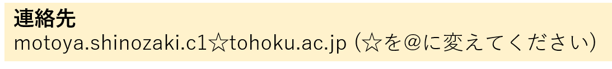

<!-- Google tag (gtag.js) -->

# 自己紹介
## 名前
篠﨑 基矢(しのざき もとや / Motoya Shinozaki) 
博士(工学)

## 所属
東北大学 材料科学高等研究所(AIMR)

## 略歴
2009/4 国立小山工業高等専門学校 電気情報工学科 入学 
2014/3 国立小山工業高等専門学校 電気情報工学科 卒業 (小林(康)研究室) 
2014/4 東北大学 工学部 情報知能システム総合学科 編入学 
2016/3 東北大学 工学部 情報知能システム総合学科 卒業 
2016/4 東北大学大学院 工学研究科 電子工学専攻 博士前期課程 入学 
2018/3 東北大学大学院 工学研究科 電子工学専攻 博士前期課程 修了 ([大野研究室](http://www.ohno.riec.tohoku.ac.jp/japanese/index.html){:target="_blank"}) 
<!-- 2018/4 Huawei Japan 入社  -->
2018/10 東北大学大学院 工学研究科 電子工学専攻 博士後期課程 編入学 
2020/4 日本学術振興会特別研究員(DC2) 
2022/3 東北大学大学院 工学研究科 電子工学専攻 博士後期課程 修了([深見研究室](http://www.spin.riec.tohoku.ac.jp/){:target="_blank"}, [大塚研究室](https://ja.qd.riec.tohoku.ac.jp/){:target="_blank"}) 
2022/4 東京大学大学院 工学系研究科 マテリアル工学専攻 助教  
2023/3 東北大学 材料科学高等研究所(AIMR) 特任助教 ← 今ここ  

### 非常勤
2025/5 物質・材料研究機構 ナノアーキテクトニクス材料研究センター 客員研究者

## 受賞等
2020/12/19 第1回セキュリティ・フォレンジック・ワークショップ 3位入賞 
2022/3/25 東北大学大学院 工学研究科長賞 

## その他
[reseachmap](https://researchmap.jp/nanodora){:target="_blank"} 
<!-- [GitHub](https://github.com/MotoyaShinozaki){:target="_blank"}  -->
[ORCiD](https://orcid.org/0000-0001-9460-9156){:target="_blank"} 
[オープンバッジ](https://www.openbadge-global.com/ns/portal/openbadge/public/assertions/user/MG1JcDdIeGg4V2JCajdQTzkwd1ZrQT09){:target="_blank"} 

# Return
[Topに戻る](https://motoyashinozaki.github.io/minidora/)