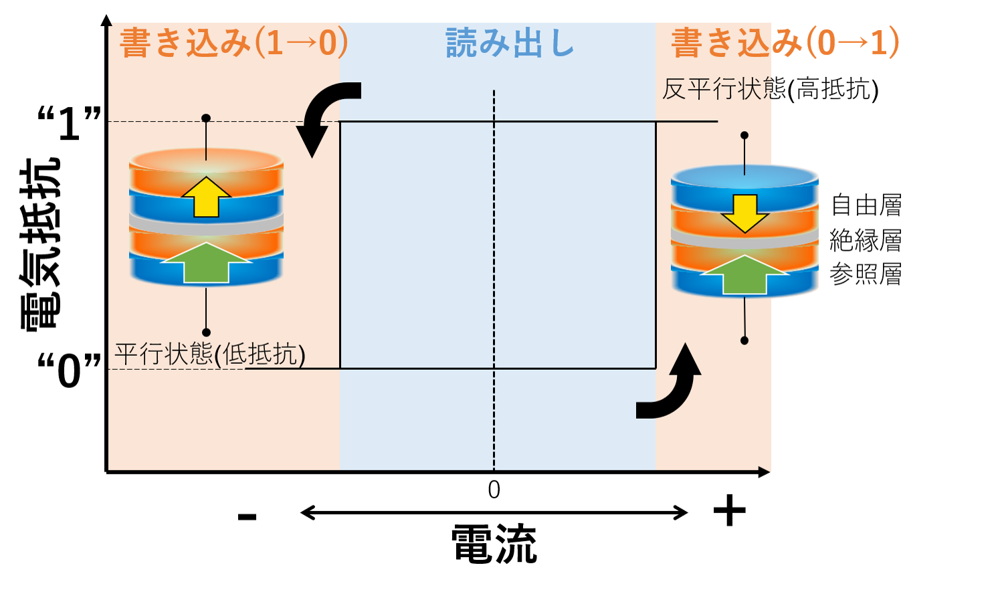

<!-- Google tag (gtag.js) -->

# MTJ(磁気トンネル接合)
## 原理

学部・修士の間(2015-2018)は磁気トンネル接合(MTJ : Magnetic tunnel junciton)素子に関する研究をしていました。

MTJとはナノメートルスケールの薄い絶縁層を二つの強磁性層で挟んだ積層構造で構成され。磁化方向が反転しやすい強磁性層と反転しにくい強磁性層を有し、これらをそれぞれ自由層、参照層と呼びます。MTJ素子の抵抗値は自由層磁化と参照層磁化の相対角度によって決まり(トンネル磁気抵抗(TMR)効果)、二層の磁化方向が平行のときに最小値、反平行のときに最大値を取ります。

 
<em>図1. MTJの特性</em>

この抵抗値の大小をbit情報の"1"と"0"に対応させることで、メモリとして応用することができます。加えて磁化が平行か反平行かは電気などを供給することなくその状態を維持することができるので、情報の保持に電力が必要ない不揮発性メモリを実現することができます。
この自由層の磁化方向を制御する方法として、応用上一番注目をされているのが電流による磁化反転です(スピン注入磁化反転)。bit情報の書き込み時はある程度大きな電流(反転閾値電流)を流すことで自由層磁化の反転を促し、読み出し時は磁化反転しない程度の電流を流し抵抗値を読み取ることで"1","0"を判定します。
したがって、このMTJ素子を低消費電力で動作させるためにはこの反転閾値電流を如何にして小さくするか、という点が重要となります。
それではこの反転閾値電流は何によって決まるのでしょうか？様々な仮定の元で次のような式が導かれます。 
  

ごちゃごちゃと色々なパラメータがありますが、ここで注目してほしいのは主にはダンピング定数α, 飽和磁化Ms, 異方性磁界HKeff, 自由層体積tS(膜厚と面積の積)です。
MTJ素子をメモリとして応用していく上では大容量化のために素子の微細化(面積Sを小さくする)が欠かせません。<b>上の式をよく眺めてみると面積Sが小さくなるほど、つまり微細化すればするほど磁化反転に必要な電流が小さくなることがわかります！これこそがスピン注入磁化反転の大きな利点であり、微細化に有利な磁化反転方式であることがわかります。</b>
上の式で色々なパラメータがありますが、中でもダンピング定数α, 飽和磁化Ms, 異方性磁界HKeffはMTJに用いる材料に依存します。したがってより性能の良い(反転閾値電流が少ない)MTJ素子を実現するためには、材料がどのような磁気特性を有しているかを探索する必要があります。

--用語説明-- 
ダンピング定数：磁気的な摩擦の強さを示すような定数 
飽和磁化：磁石の強さのようなもの 
異方性磁界：やはり磁石の強さのようなもの。磁石をある方向から別の方向に向けるのに必要なエネルギーのようなもの 

# 関連項目
[MTJ素子の熱安定性](./thermal.md)

# Return
[Iroiroに戻る](../iroiro.md) 
[Topに戻る](https://motoyashinozaki.github.io/minidora/)