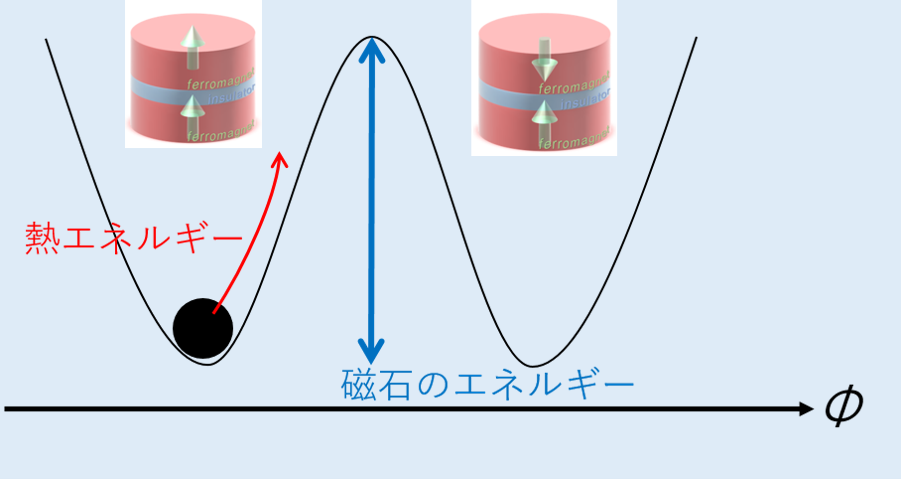
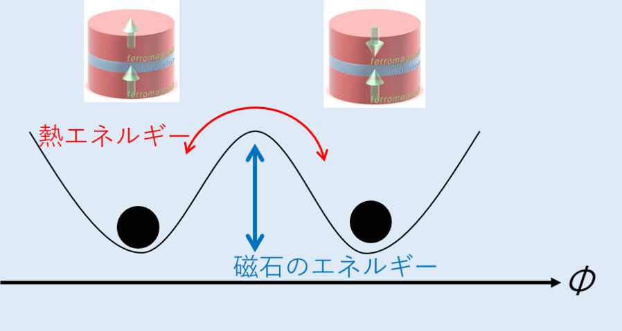

## MTJ素子の熱安定性

"[MTJ](./mtj.md)"では、スピン注入磁化反転に必要な電流は材料依存のパラメータ(ダンピング定数α, 飽和磁化Ms, 異方性磁界HKeff)に依存することを述べました。 
  
これだけみると、この3つのパラメータが小さければ小さいほど良いように見えますが(省エネのために反転に必要な電流量は小さくしたいので)、果たしてこれでいいのでしょうか。
実はMTJ素子を応用する上で大事な指標には、この反転閾値電流Icに加えて熱安定性Δという指標が存在します。 
 
一見よく分からない式に見えますが、よく見ると(MsHV/2)と(kT)の比になっていることがわかります。(MsHV/2)は磁石が持つエネルギーでありkTは熱エネルギーを表しているので、その比であるΔは熱エネルギーに対して磁石がどれくらいエネルギーを有しているかを表す指標となります。 

 

 
少し難しいですが、上図はMTJ素子の自由層磁化方向Φに対するポテンシャルの概略です。(Φ=0が平行、Φ=πが反平行状態に相当します)
平行状態にいたMTJ素子は熱エネルギーにより反平行状態へ遷移しようとしますが、磁気エネルギーが壁となってそれを阻止します。つまり熱安定性Δが大きい(熱エネルギーに対して磁気エネルギーが大きい)とMTJは状態を安定して維持することができます。
一方で、Δが小さいと熱エネルギーが磁気エネルギーの壁を超えてしまう現象が起きてしまいます。 

 

 
このとき外部から磁界や電流を印加せずとも、熱により勝手にMTJの平行・反平行状態が行き来してしまいます。不揮発性メモリとして応用したいのに、放置している間に勝手に"1","0"のbit情報が勝手に書き換わってしまうのではとてもじゃないですが使い物になりません。
したがってこの熱安定性Δは、MTJ素子の不揮発性メモリへの応用を考える上ではある程度大きいことが要求されます。 
ただ近年では意図的にΔを小さく設計し、"1", "0"状態を行き来するようなMTJを使った情報処理も提案されており、その応用の幅はまだまだ広がっています(これはまたいつかの機会に)。

# 関連項目
[MTJの基礎](./mtj.md) 

# Return
[Iroiroに戻る](../iroiro.md) 
[Topに戻る](https://motoyashinozaki.github.io/minidora/)