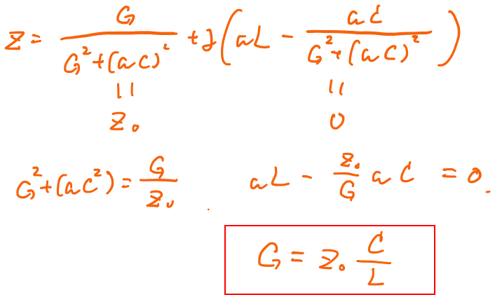

# 高速測定のための量子ドット設計指針

"[量子ドットの高速測定](./rf_meas.md)"では高周波反射測定による高速測定を紹介しましたが、実はこの手法は全ての量子ドットに使える万能なものではありません。 
このページでは、高速測定が可能な量子ドット設計について考えていきます。まずは図1に高周波反射測定の回路を再掲します。 
この測定のキモは、"電荷計の電気伝導度の変化に依存して反射波の大きさが変化すること"でした。測定回路がそのような感度を持つためには、インピーダンス整合が成立している必要があります。(整合条件から遠く外れている部分では、伝導の変化に依らず殆どの信号が反射されてくるため、伝導依存を持たなくなってしまいます。) 
この共振回路に対するインピーダンス整合条件は図2の式のように計算できます。 

 
<em>図2. インピーダンス整合条件</em>

実際の測定回路では、Gが量子ドットの検出に用いる電荷計のコンダクタンス、Cは試料近傍における寄生容量、Lは市販品コイルチップのインダクタンス、Z0は高周波ケーブルの特性インピーダンスに相当します。 
ここで電荷計は量子的な伝導を利用していることから、の条件が要求されます。 
また高周波ケーブルを用いることで線路の寄生容量は実効的に無視できますが、結局試料中ではゲート電極等による寄生容量が形成されます。共振回路を作製するために取り付けるコイルは市販品がよく用いられ、典型的には大きくて1.2 μH程度となります。 
このようにZ0, G, Lは様々な制約から殆ど一意に決まっているため、図2に示すようなインピーダンス整合条件を満たせるかは寄生容量Cに依存します。 

したがって、**高速測定が可能な量子ドットかどうかはデバイスが持つ寄生容量の大きさで決まります**。 
試しに典型的な値を代入してみると 
 
となり、1pF以下程度まで低く設計する必要があります。 
容量は面積に比例し、絶縁層の厚さに反比例します。トップゲートやバックゲート、サイドゲートなど様々な電極構造の最適化と絶縁層の材料等と相談することで高速測定が可能となります。 
最近では、GaAs系やSi系のみならずグラフェンナノリボンでも量子伝導が報告されています。構造や材料の制御により新たな物性を発現させるのと同時に、測定まで見通したデバイス構造が益々重要になることと思われます。

## 参考文献
1. 「CVDグラフェンナノリボンの電気伝導特性測定」、 
北田孝仁、阿部峰也、瀬尾瑞樹、金子俊郎、加藤俊顕、大塚朋廣、 
日本物理学会、名古屋、2020年4月 

## [量子ドットの高速測定に戻る](./rf_meas.md)
## [Iroiroに戻る](../iroiro.md)
## [Topに戻る](../iroiro../content../index.md)