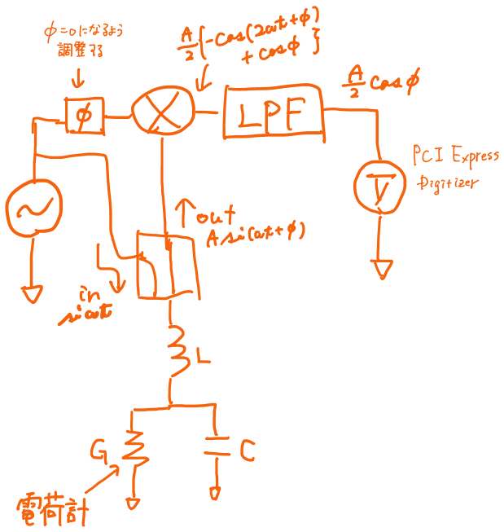

# 量子ドットの高速測定
## はじめに
ニュースや紙面を飾る華やかな新奇物理現象・機構の観測・理解の裏には、測定技術への弛まぬ努力の歴史があります。
量子デバイスの研究を縁の下で支える測定技術について簡単にお話します。

## なぜ高速測定が必要なのか
量子ドットの最も基本的な測定は、電圧を印加して電流を測定することです。量子伝導が見えているか、ゲート構造ができているか、などなど様々な場面で伝導の測定を行います。 
例えば二重量子ドットを形成した際には、2つのゲート電極を掃引しながら測定を行います。 
この際にそれぞれ100点ずつデータを取ろうとすると、計10,000点もの点数が必要になります。これら1点1点の測定は信号がノイズに埋もれないよう時間積算を行うため、非常に長い測定時間が必要になります。 
条件を変えて再測定となるとまた10,000点。。。途方も無い時間が過ぎていきます。 
また、量子ドット中のスピン状態はマイクロ秒程度で消失してしまうため、スピン状態の生成から測定までを高速に行う必要があります。 
観測が難しいスピン状態を観測が容易な電荷状態に変換する技術は成熟しており、電荷状態を検出する技術の進歩が期待されます。 
このように量子ドットの実験現場では測定の高速化が要求されます。 

## 何が測定速度の上限を決めるのか
そもそも測定速度を決定する要因は一体何なのでしょうか。高速で動作する電圧源や電流計を準備すれば良いように思えますがそう上手くはいきません。 
一般に量子ドットの測定は低温で行いますが、その冷却のために長い配線を冷凍機と熱的接触を取りながら敷いていきます。これにより配線と冷凍機本体等の間に寄生容量が測定対象と並列に形成されてしまいます。容量のインピーダンスは周波数に反比例するため、測定対象に対してローパスフィルタを形成してしまいます。 
また測定される電流値はnAオーダーと非常に微小なため、一般的にI/V変換器を用いて電圧に変換して読み出します。このI/V変換器が高速測定に追随しない、という根本的な問題も存在します。 
更に検出する上ではノイズとの戦いもあります。例えば"0"と"1"の状態を形成したとき、これらの信号の差はノイズに埋もれてしまいます。そのため平均化処理をするのですが、そこで必要なサンプリング数が多いほど、またはサンプリング時間が長いほど時間がかかります。(このあたりはまた別の記事にて) 
加えて、測定機器とそれを制御するパソコンの間の通信速度もボトルネックとなる場合もあります。 
このように様々な意図せぬ要因により測定帯域が制限されてしまい、高速測定が困難になります。 

## 高周波反射測定
これらの問題を解決するためにBarthelさんらが量子ドット用に開発した高周波反射測定法があります。前述した寄生容量を極力減らすため高周波ケーブルを通じて試料に信号を印加し、反射してくる信号を検出する手法です。このとき、実効的に寄生容量を低減するためには高周波信号を印加する必要があります。図1に測定回路の例を示します。量子ドットの電荷状態は、電荷計の伝導度Gに影響を与えます。したがって、電荷状態が変化し電荷計の伝導度が変化した結果、共振回路の反射係数が変化します。この反射係数の変化を検出することで電荷状態の検出を行います。 

 
<em>図1. 高周波反射測定回路</em>

そのために方向性結合器とミキサ、ローパスフィルタを用います。方向性結合器は入出力を経路を分離することができ、共振回路からの反射波のみを取り出すことができます。 
このとき、入力信号をsinωtとすると、反射波は振幅が減衰し位相変化してと表されます。これらの2つの信号をミキサで掛け合わせると三角関数の積和公式より, とミキサ出力が得られます。ここで入力信号と反射波の位相φが0になるように、入力信号とミキサの間に位相シフタを挿入しておきます。ミキサ出力の第2項目は時間に依存しない直流項となっています。ローパスフィルタを通じてこの直流項のみを取り出すことで、反射係数に依存する出力電圧を検出することができます。 
このようにして高周波信号を用いて電荷状態の検出が可能になりました、そして配線容量等を低減したことによりその測定帯域はMHzオーダーとなり高速測定が実現できます。 

## インターフェイス
実験装置とパソコン等を結ぶインターフェイスには、GPIB(General Purpose Interface Bus)と呼ばれる規格が広く用いられています。この規格のデータ転送速度は最大で1 MB/s ですが、例えば電荷状態を8 ns のサンプリング時間で50 ms ほど測定を行うと 数百MBものデータ量になり、データ転送が間に合いません。
ならば、一旦測定器のメモリにデータを格納し、測定終了後に一括で移せば良いように思えますが、取れるデータ量が限られてしまうことやデータ転送にかかる時間を考えるとトータルで測定速度が遅くなってしまうという問題が生じます。 
いくら測定回路を工夫したところで、結局インターフェイスの転送速度で速度の上限が律されてしまいます。
そこでデータのスループットを改善する方法としてUSBやLAN等のGPIB以外のインターフェイスの利用が考えられます。 
中でもパソコンのマザボ等に直接搭載可能なPCI Expressインターフェイスを用いたデジタイザは数GB/sの転送速度をもち、回路に負けない高速な測定を実現することができます。 

## まとめ
量子ダイナミクスの観測には高速測定は欠かすことのできない大事な技術です。 
測定速度は配線の寄生容量等により制限され、これを解決するために高周波ケーブルを導入し、高周波信号の反射係数変化を通じて電荷状態を検出することができます。 
そして高速スループットを持つインターフェイスにより通信を行うことで、高速測定を実現することができます。 
今後もより高速・高精度な測定技術の進歩により、未知な面白い物理現象の観測が期待されます。 
高速測定のための量子ドット設計指針についてはこちらを参照ください。 

## 参考文献
1. "Rapid Single-Shot Measurement of a Singlet-Triplet Qubit" 
C. Barthel, D. J. Reilly, C. M. Marcus, M. P. Hanson, and A. C. Gossard, 
[Phys. Rev. Lett. **103**, 160503 (2009).](https://journals.aps.org/prl/abstract/10.1103/PhysRevLett.103.160503){:target="_blank"} 

1. 「量子デバイスの高周波測定技術―半導体量子ドット系における高周波反射測定―」 
大塚朋廣、 
[固体物理 **55**, 69 (2020).](https://www.agne.co.jp/kotaibutsuri/kota1055.htm){:target="_blank"} 

# 関連項目
# [高速測定のための量子ドット設計指針](./design.md)

# Return
## [Iroiroに戻る](../iroiro.md)
## [Topに戻る](https://motoyashinozaki.github.io/minidora/)