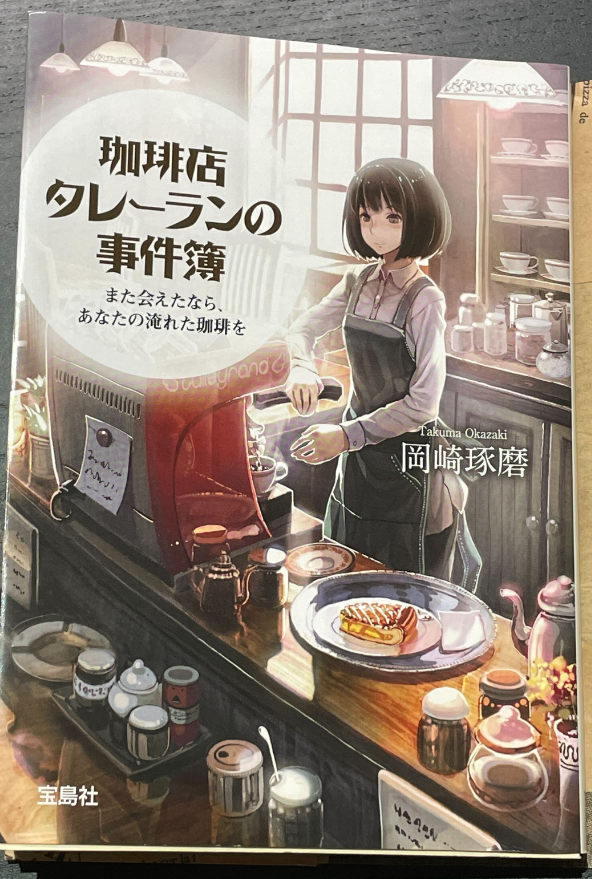

# 珈琲店タレーランの事件簿
## 著:岡崎琢磨

シリーズものの1巻目。 
ある日、夕食後に大学近くのこじんまりとした本屋さんに足を運ぶと、ミステリー小説が沢山並んでいることに気づく。
ふと自分が最近読んできた本を振り返ると、新書や論評などなんだかお硬い本が多いなあと・・・。
現代の文学作品は未開拓分野である。 
ミステリー小説といえば、中学生くらいの頃に"容疑者Xの献身"や"ダ・ヴィンチ・コード"を読んだことある程度、もっと遡れば小学生くらいの頃にはシャーロック・ホームズシリーズは色々読んだ記憶もあり、久々にミステリー読むのも悪くないかなあと思い立つ。 
本棚を眺めると、ドラマ・映画化されて名前だけなんとなく聞いたことあるような作品が目に入る中、一際目を引いたのがこの本。
コーヒーとミステリー、なんか良さげな組み合わせそうだなとか、タイトルから推察するに極悪な犯罪が起きるわけでなく日常モノに近いだろう、それなら軽く読めていいな・・・などと思いつつ購入。

  
前置き(言い訳)が長くなってしまった。正直に言うと、完全に表紙買いである。
たまたま目に入った表紙の子が完全に好みな感じでした・・・以上。 

 
<em>ラノベを読みまくっていたあの頃を思い出す、本書に挿絵はないけど・・・</em>

# Return
[読んだ本たちに戻る](../book_log.md) 
[その他に戻る](../others.md) 
[Topに戻る](https://motoyashinozaki.github.io/minidora/)