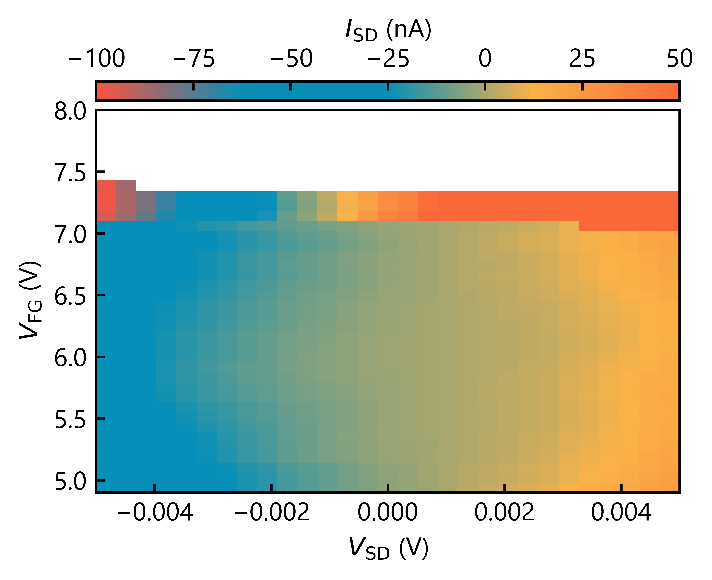

<!-- Google tag (gtag.js) -->

# デバイス最後の日(2025/5/3)

## Jan. 24th, 2024 measured by Motoya Shinozaki

## 解説
"これ、ゲートリークしたときの図みたいだぁ・・・" 
ある日、美術館で日没を描いた絵画を見たとき、真っ先に感じたこの感覚を表現した作品。
以前ゲートリークが見えた際のデータを掘り起こし、オリジナルカラーマップを用いて水平線に沈む夕日を表現。 
横軸はソースドレイン電圧、縦軸はゲート電圧、カラー強度はソースドレイン電流。 
ゲート電圧を大きくしていくと、7Vを超えたあたりで急に電流値が増え、色合いがベタ塗り状態に。
これがゲートリーク電流によるものである。
リークしつつも電流の符号はおおよそソースドレイン電圧によって決まるため、リーク電流の作る夕焼けは7V以下で薄いオレンジとなって海辺に反射する。 
一方でVsd=-0.003Vあたりの空には、まだ夕焼けに染まりきらない青い部分が。
どんなにカラーマップを調整してもここだけは思い通りに描かせてくれない、まるで自然の理不尽さを感じさせられる。 
ところで、なぜ最後の日なのか。 
これはゲートリークしたデバイスは基本的に壊れてその後使い物にならなくなるためである。
したがってリークしたら最後、もうこの風景は見れない、普通は。 
幸か不幸か、この測定をリアルタイムで眺めていたらゲートリークが見えたので、急遽測定をストップした。
その痕跡が、8Vまで印加予定だったゲート電圧の軸が作る空白として残っており、実験室での緊迫した空気を伝えてくれる。 
このデバイスは結局どうなったのか、その後ある論文で使われたとか・・・。 

# Return
[チラシの裏に戻る](./zakki.md) 
[その他に戻る](../others.md) 
[Topに戻る](https://motoyashinozaki.github.io/minidora/)