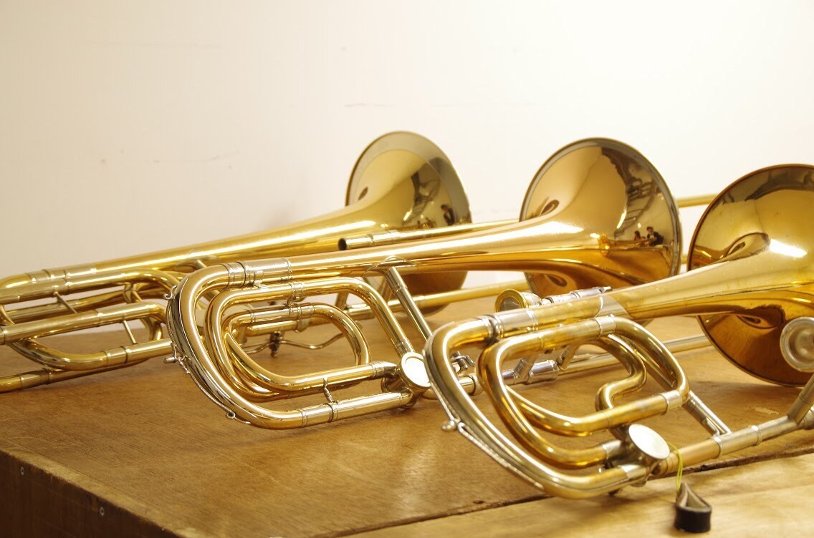
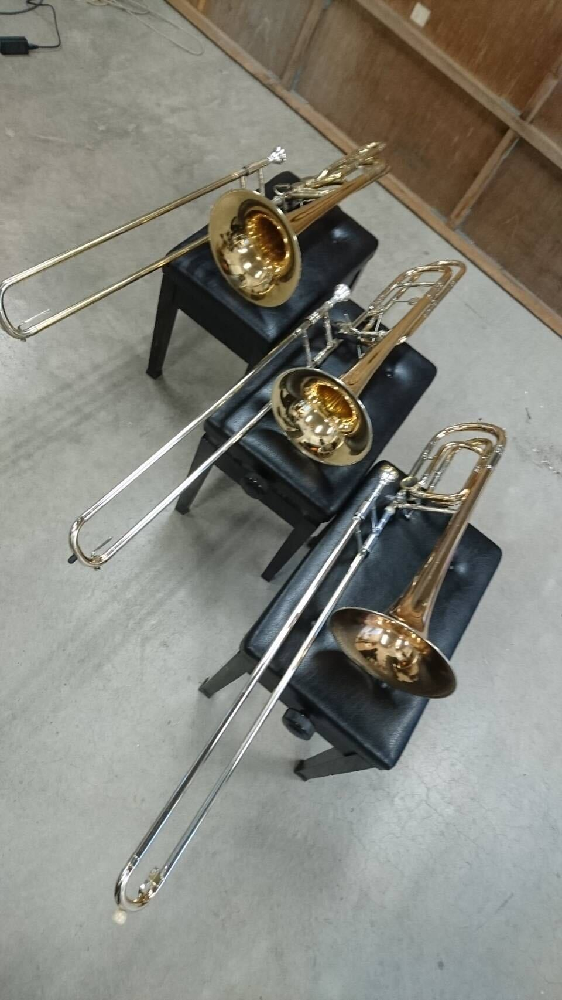
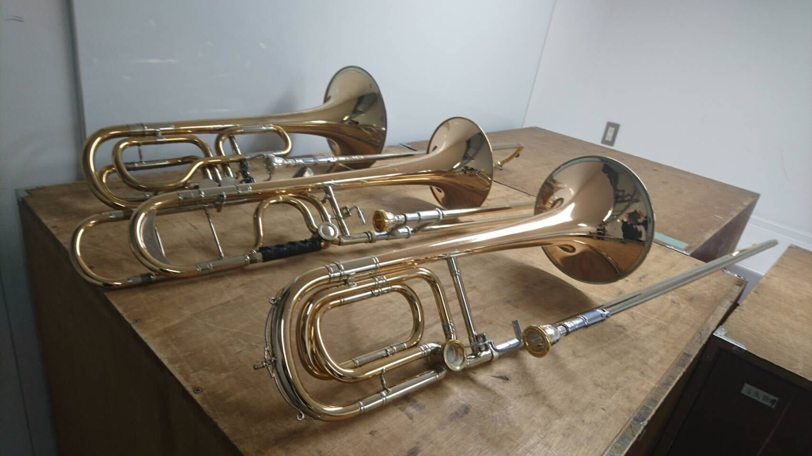
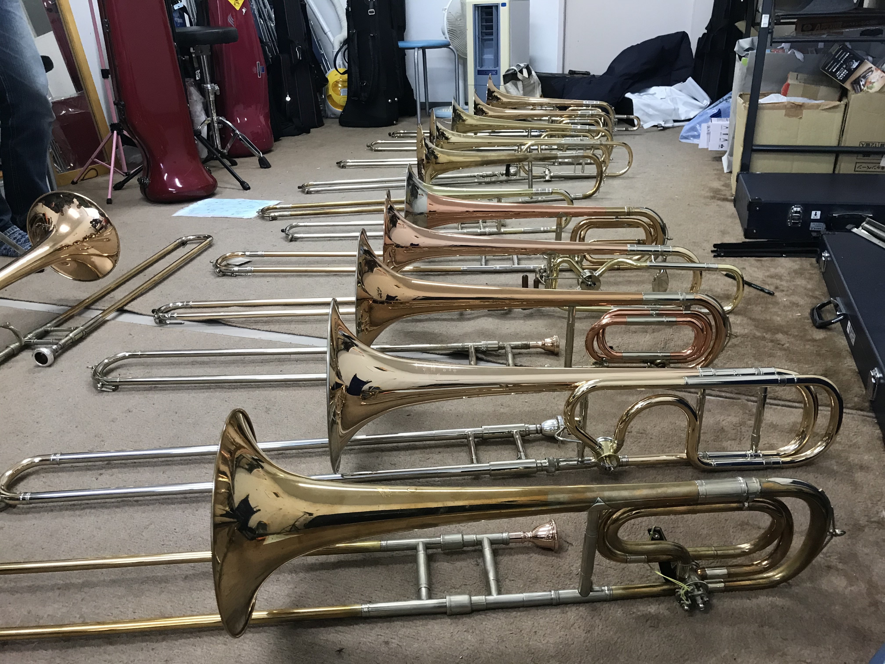
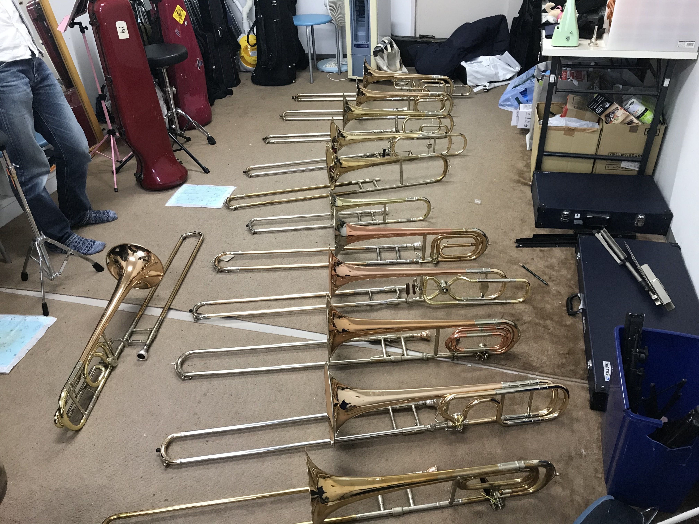
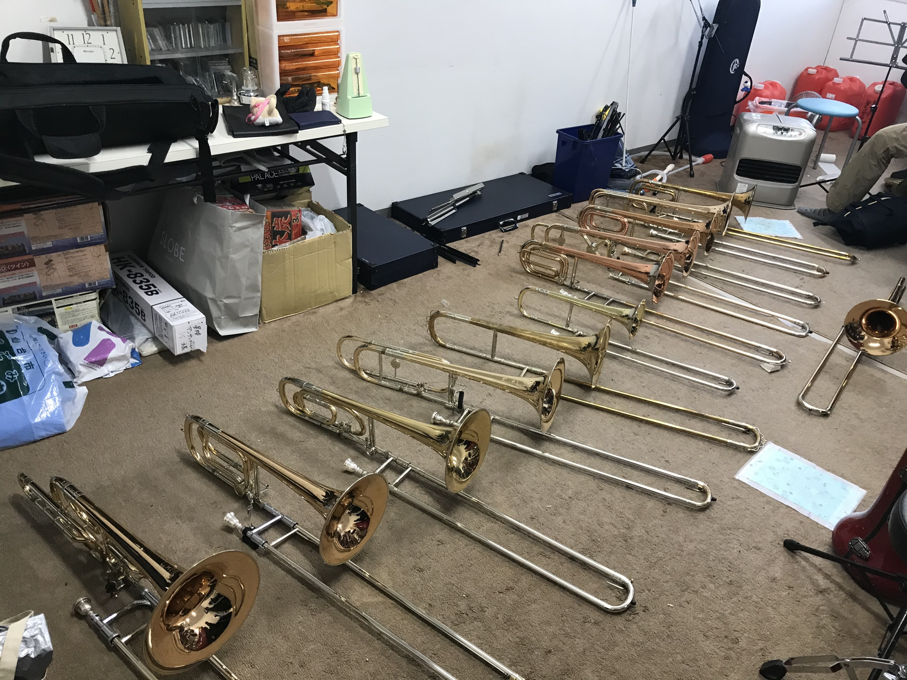

# ドイツ管の音色に耽る

学生時代、東北大の交響学部でトロンボーンを吹いていました。
吹奏楽やジャズなどでもよく用いられるため、なんとなく見たことある人も多い楽器だと思います。

そんなトロンボーンですが、様々なメーカーが作っております。
代表的なのは、我々にとても馴染み深い"ヤマハ"でしょうか。
学校の備品楽器としてもよく採用されています。
拘りのある学校とかだと、"Bach"や"Conn"といったメーカーも備品候補にでてきそうです。
備品じゃなくマイ楽器が欲しい！となると"Getzen"や"Shires"なども選択肢に挙がってきます。

さて、ここまで挙げてきたメーカーは所謂アメリカ管と呼ばれ、今や国際標準的スタイルのトロンボーンです。
これに対し、ドイツ管と呼ばれるトロンボーンが存在します。
その名の通りドイツで作製され、アメリカ管とは異なる特徴を有しています。
例えば 
・チューニング管やスライド先端に蛇飾りの装飾がついている 
・ベル縁がクランツと呼ばれる金属に覆われている 
・ベルの円錐形状が異なる、大雑把に言うと短くて太い 
・チューニング管部分にF管も付随しており、F管なしチューニング管(テナーボーゲン)と交換することで、テナーバス⇔テナー管の換装が可能 
・第7倍音の音程が高めになる(1ポジのHi-Asが実用的で嬉しい！) 
・ロングウォーターキーと呼ばれる機構があり、腕を伸ばすことなく手元操作で水抜き可能 
などなど・・・、もはや別物！全てのドイツ管が上記の特徴を全て備えているわけではなく、奏者の要望に応じてオプション化されてます。

このような魅力を備えたドイツ管ですが、"これまで慣れ親しんだアメリカ管から乗り換えるのはちょっと・・・"、"てかドイツ管って何？"、"売ってるの見たことねえよ・・・"、"弘法筆を選ばず、まずは己の鍛錬を"などの多くの理由により、マイナーな存在となっています。 
そんな中、私が在籍していた頃の東北大オケのトロンボーンパートではドイツ管マニアが多く、国内の大学オケでこれだけドイツ管が集まったことはもしかしたら無いんじゃないか？とさえ思います。
そんな東北大オケドイツ管黄金時代(!)を懐古していきたいと思います。 
以下、各演奏会をクリックすると展開されます。

・第163回定期演奏会(2014/11/29) 
ドイツ管時代の夜明け。

第163回定期の演目は 
前曲：ペール・ギュントより 
中曲：ベートヴェン ピアノ協奏曲第4番 
メイン：チャイコフスキー 交響曲第5番 
でした。

トロンボーンの出番があるのは前メイン、普通の大学オケらしくヤマハ、Conn、Shiresなどが立ち並ぶ中、前曲で一本だけキラリと光るレッチェが・・・！ 
その後のドイツ管時代の到来を予感させる演奏会でした。

 

・第164回定期演奏会(2015/06/20) 
全てはここから始まった・・・

第164回定期の演目は 
前曲：序曲 ローマの謝肉祭 
中曲：ベートヴェン 交響曲第1番 
メイン：ブラームス 交響曲第4番 
でした。

メインプログラムであるブラームスの4番では、1st : レッチェ、2nd : マックスエンダース, Bass : ヘルムートフォークト、となんとオールドイツ管に！ 
ドイツの交響曲をドイツ管で統一して吹く、こんな幸せな瞬間は中々巡り会えません。 
しかも皆トラディショナルタイプのガチドイツ管、セクションとしての音作りも凝りに凝ってとことん拘ります。全てはあのコラールのために。。
4楽章しか出番がないのに、一番パート練習をしてたんじゃないかと思います。 
こうして、東北大オケトロンボーンのドイツ管時代が始まった(と思っている)。

 

・第165回定期演奏会(2015/12/5) 
前曲でドイツ管サウンド炸裂！

第165回定期の演目は 
前曲：組曲「アラジン」より抜粋 
中曲：ハイドン 交響曲第101番 時計 
メイン：ドヴォルザーク 交響曲第8番 
でした。

メインのドヴォ8ではドイツ管は2ndのレッチェ1本のみ。 
本演奏会でその響きを奏でたのは前曲のアラジン組曲。
組み合わせは164回定期のブラ4と同様に1st : レッチェ、2nd : マックスエンダース, Bass : ヘルムートフォークト。 
特に2曲目の"捕虜の踊り"の冒頭では、ドイツ管特有の割れ音を伴う強音(でも心地よい)を響かせることもできました。 
全体を通じて思いきり吹ける場面が多い曲だったので、ブラ4とはまた違うドイツ管の響きを魅せることができた演奏会でした。

 

・第166回定期演奏会(2016/7/16) 
新たな仲間を加えて。

第166回定期の演目は 
前曲：歌劇「道化師」より プロローグ, 間奏曲 
中曲：歌劇「椿姫」より プロヴァンスの海と陸, 歌劇「仮面舞踏会」より	お前こそ心を汚すもの 
メイン：チャイコフスキー 交響曲第6番 悲愴 
でした。

166回定期では、メインのチャイ6でドイツ管勢ぞろい！ 
1st : レッチェ、2nd : トローヤ, Bass : ヘルムートフォークト。 
この演奏会から新たにドイツ管が増え、計4本に。ベルリンフィル首席のオラフ・オットでもお馴染みのトローヤ。 
チャイ6はトロンボーン冥利に尽きる曲で、曲中で多くの性格を覗かせてくれます。
それに伴いドイツ管の様々な音色も・・・。 
オールドイツ管での演奏会も数をこなして慣れてきた頃でもあり、パートの矜持を感じる音が炸裂します。
逆に拘りすぎて金管の中でトロンボーンだけ浮いているようにさえ思えてしまう、それくらい劇的な演奏会でした。 

 

・第167回定期演奏会(2016/12/3) 
名器登場！

第167回定期の演目は 
前曲：劇付随音楽「真夏の夜の夢」より 
中曲：幻想序曲「ロメオとジュリエット 
メイン：ベートヴェン 交響曲第3番 英雄 
でした。

前曲は1stレッチェ、Bassレッチェ、中曲でも2ndレッチェ、Bassレッチェとレッチェ祭り！ 
レッチェのバストロということで、チースリクモデルがついに登場。 
3本勢揃いはなかったものの、トロンボーン乗り番曲全てにおいてドイツ管が舞台に立った演奏会でした。

 

・第168回定期演奏会(2017/6/17) 
未完成でもパートは完成。

第168回定期の演目は 
前曲：歌劇「リエンツィ」序曲 
中曲：シューベルト 交響曲第7番 未完成 
メイン：ブラームス 交響曲第2番 
でした。

更新中 

 

・第169回定期演奏会(2017/12/9) 
北欧の風にドイツ管の響きを・・・

第169回定期の演目は 
前曲：交響詩「フィンランディア」 
中曲：ベートヴェン 交響曲第8番 
メイン：シベリウス 交響曲第2番 
でした。

更新中 

 

・第170回定期演奏会(2018/6/30) 
アルトが欲しい！

第170回定期の演目は 
前曲：悲劇的序曲 
メイン：ベートヴェン 交響曲第9番 合唱付き 
でした。

更新中 

 

・第171回定期演奏会(2018/6/30) 
やっぱブラームスにはドイツ管！

第171回定期の演目は 
前曲：歌劇「タンホイザー」序曲 
中曲：モーツァルト ピアノ協奏曲第23番 
メイン：ブラームス 交響曲第1番 
でした。

更新中 

 

・第172回定期演奏会(2019/7/13) 
アメリカ管の足音が。。

第172回定期の演目は 
前曲：交響詩「レ・プレリュード」 
中曲：メンデルスゾーン 交響曲第4番 
メイン：チャイコフスキー 交響曲第5番 
でした。

更新中 

 

・第173回定期演奏会(2019/12/7) 
ドイツ管時代よ、永遠に。

第173回定期の演目は 
前曲：レオノーレ序曲第3番 
中曲：アメリカ組曲 
メイン：シベリウス 交響曲第1番 
でした。

更新中 

 

最終的に集まったドイツ管達、よくもまあこんなに集まったものです。

 
 
 

写真1,２枚目、手前から順に 
マックスエンダース 
B&S 
ユルゲンフォークト 
ユルゲンフォークト 
ヘッケル 
Takao Nakagawa 
オスカーウルマン 
トローヤ 
フレッチナー 
レッチェ 
レッチェ 
1本だけ縦に置かれているのは、名誉ドイツ管のConn 
# Return
[チラシの裏に戻る](./zakki.md) 
[その他に戻る](../others.md) 
[Topに戻る](https://motoyashinozaki.github.io/minidora/)