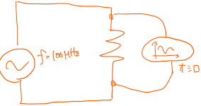
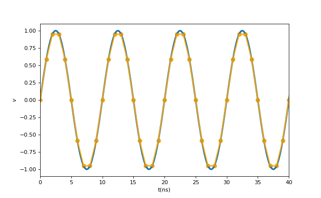
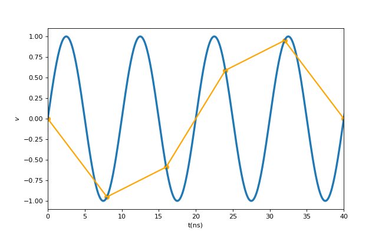
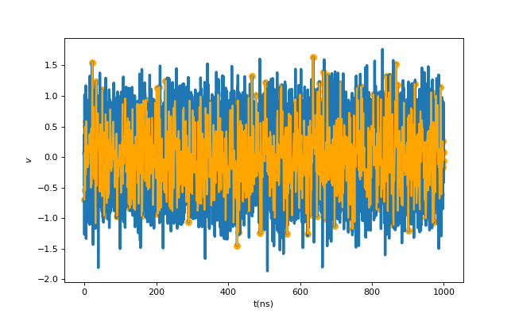
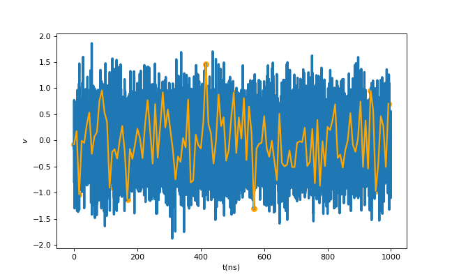
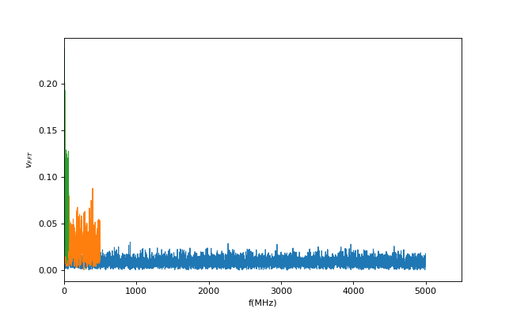
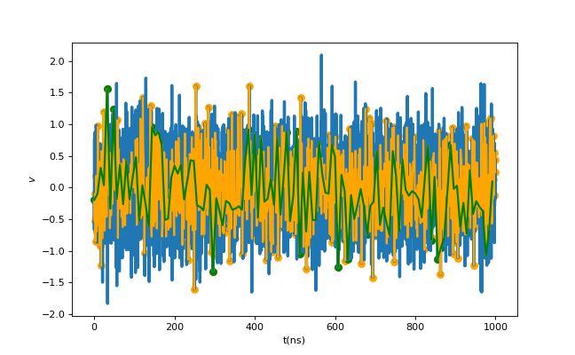

# 量子力学と白色ノイズの観測
## はじめに
きっかけは、量子ドット測定のノイズに関する自分の計算結果への違和感からでした。 
今ではその違和感は解消し、よくよく考えれば明らかに自明な事ではありましたが、そこへ至るまで過程で個人的に面白いと思ったことを書き連ねたいと思います。 
なんだかスピリチュアルな説明も含みますが、量子力学の解釈等に関する議論をするわけではありません。
(*本記事はあくまで量子力学的な現象を身近に感じてもらうための記事で、その物理的な解釈等の正しさを保証するものではありません。)

## 量子と古典の世界における観測
一般的に"量子力学"と聞くとよくわからず取っつきにくいという印象を持つことが多いと思いますが、その一因に電子の波動関数としての性質が挙げられるでしょう。 
ナノスケールの小さな箱に閉じ込められた電子は波として振る舞い、箱の中全体に対して存在確率を有しますが、電子を観測した瞬間に他の位置での存在確率が無くなり、観測地点に波動関数が収縮します。(議論を生む表現ですが、取り敢えず収縮と表現します) 
何を言っているのかよくわかりませんね、私達の一般常識の通じる古典の世界について考えてみましょう。電子を閉じ込める箱のスケールを連続に大きくしていくことでいつしか私達の日常の世界が訪れます。 
今この記事を書いている私の目の前にはキーボードやディスプレイがありますが、目を瞑ってこれらを観測しなくとも確かにそこに存在します。(これもまた若干の議論を生む余地はありますが、、) 
量子力学的な解釈を無理やり適応すると、目を瞑っている間はキーボードがそこに存在するかどうかはある確率で記述され、目を開けて観測することでその存在を初めて確かなものにできます。
普段私達が目にするの古典の世界では、この宇宙の中で確かにその場所に存在を保証されている事実の一部を観測しているに過ぎない、とも言えるような気がします。 
簡単に纏めると、量子力学では事象は確率的に存在しており、観測することでその範囲で全て再定義されます。 
古典(我々の日常)の世界では、観測の有無に関わらず宇宙全体で既にその存在が保証されており、観測というのは氷山の一角を見るに過ぎないのです。(個人の感想です)

## 白色ノイズの観測
色々御託を並べましたが、ここからが本題です。これまで述べたように量子力学の解釈は私達の直感と異なりその理解を困難にさせます。そこで、もっと身近に量子力学的解釈と似たような例を感じることができると個人的に思ったのが白色ノイズです。あくまで似たような例ですが。 
ノイズの話に入る前に、簡単な交流回路の測定について考えてみましょう。図1のように理想電圧源から100MHzの電圧を入力し、オシロスコープで実時間測定を行います。ここで重要なのがオシロスコープの時間分解能です。 

 
<em>図1. 回路図</em>

今、時間軸の最小単位が1nsと8nsのオシロスコープを用意したとしましょう。すると図2, 3のオレンジ線のように印加電圧の検出が行われます(青線は印加電圧)。1nsサンプリングでは程よく100MHz信号を再現できますが、8nsサンプリングでは上手く行かず、見かけ上40ns周期の信号(25MHz)に見えてしまいます。 
 

  
<em>図2,3. 1ns, 8nsサンプリング</em>

このようにオシロの性能によって見える信号が変わってしまいますが、重要なのは確かにそこには100MHzの信号が存在するが、装置の性能故に見ることができなかったという点です。実験で見えなくても確かに100MHz信号はそこに存在します、なんだか古典の観測っぽい感じがしますね。 
さて、実際の回路ではノイズが重畳します。例えば抵抗の熱等に由来する白色ノイズは全ての周波数成分を持つノイズとしてよく知られています。 
先程の100MHz信号と同様にこの白色ノイズをオシロで観測してみましょう。ここでは計算上、適当も白色ノイズの要件を満たす擬似ノイズを1us分だけ出力して検出します。 
図4では1ns毎、図5では8ns毎にランダムにノイズが乗っている様子が見え、一見良さそうに見えます。このノイズについてもう少し詳しく調べてみましょう 
 

  
<em>図4,5. ノイズの1ns, 8nsサンプリング</em>

ノイズの特性を調べるためにフーリエ変換を施したものが図7です。青が元ノイズ、オレンジと緑はそれぞれ1ns, 8nsサンプリングしたノイズを示しています。元データは0.1ns刻みで出力しているため、1/(2*0.1n)=5GHzまで得ることができ、サンプリング後はそれぞれ500MHz, 62.5MHzまで得られます。これは前述したようにサンプリング時間が長いと高周波数成分を検出できないことを意味しています。 
 

 
<em>図6. ノイズの周波数スペクトル</em>

ここでスペクトル振幅に着目してみましょう、サンプリングをすることで振幅が大きくなり、サンプリング時間が長いほど更に大きくなります。 
これは、サンプリングにより見かけ上消えてしまった高周波成分達が、サンプリング周波数以下の信号として検出されていることに由来します。図3では本来100MHzだった信号は25MHzとして検出されたことと同様の事が、見えなくなった全ての周波数成分に対して起きています。 

ここからが大事です、元ノイズデータの時間刻みを0.1nsから0.2nsにして同様にフーリエ変換を施したものが図8です。刻みを倍にした分、周波数帯域は半分になりますが、ノイズ振幅を保つためにスペクトル振幅はおよそ倍になります。結局、サンプリングをしようが、元ノイズの時間刻みが荒くなろうが、あるノイズ振幅に対して周波数スペクトルの面積は常に一定になります。 
 

 
<em>図7. 0.2ns刻みノイズの周波数スペクトル</em>

つまりオシロスコープの性能に依らず、得られたノイズは観測しきれなかった世界(周波数)の情報も含んでいます。 
オシロのような帯域のある測定器があって初めてノイズが定義できるのでは？という気もしますが、オシロの有無に関わらず回路や抵抗があればそこには必ず白色ノイズが存在するでしょう。そして測定する前は無限小の時間分解能(無限大の周波数帯域)でノイズを発生させていますが、測定(観測)することで有限の周波数帯域で定義されるノイズに"収縮"します。収縮されたノイズには情報の損失は存在せず、観測範囲内で全て事足ります。 
8nsサンプリングのオシロで観測した100MHz信号は、25MHzと検出されてしまい、本来の入力信号が100MHzなのか400MHzだったのか区別することはできません。 
しかし無限大まで周波数成分を持つ白色ノイズを8nsオシロで観測しても、高周波数成分の情報はしっかりとその周波数スペクトルの面積に収められています。白色ノイズは全周波数域で一定という性質があるため、このようなことが言えます。 

## まとめ
ある特定の周波数成分を有する信号の観測は古典的ですが、無限大まで全周波数成分を有する白色ノイズの観測はまるで波動関数の観測・収縮のようではないでしょうか。 
あくまで何だか似たような感じというだけですが、量子力学特有の振る舞いを少しでも身近に感じることができれば幸いです。