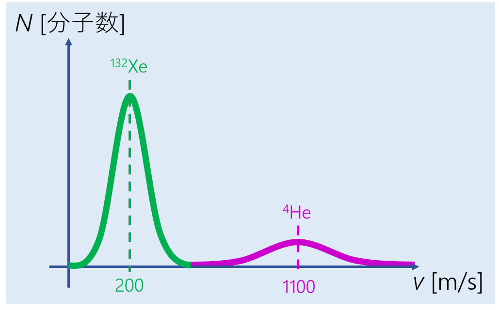

# 気体分子運動論
## なぜ気体分子運動論？
真空技術を語る上で欠かせないのが気体分子運動論です。 
そもそも真空とはどのような空間なのでしょうか？広辞苑で真空と引くと一例として"空気・ガスなどの物質が一切存在しない状態。また、その空間。"と出てきます。宇宙空間のような、なんとなく普段イメージする真空の印象と近いですね。 
一方でJIS(日本工業規格)によると、"大気圧より低い圧力の機体で満たされている特定の空間状態"として定義されています。つまり宇宙のように無の空間でなくとも、ある程度の低圧状態で良いということになります。それでは"特定の空間"とは一体何のことでしょうか。富士山のような高いところでは空気が薄い(大気圧より低い)ですが、これを真空とは呼ぶ人はいない筈です。"特定の空間"というのは人工的に作られた空間を指しており、例えば掃除機等で作る圧縮真空袋のようなものなどが挙げられます。 
工業的な真空状態においては、ある程度物質が存在しても良いということがわかったところで、実際にどの程度気相分子が存在するのか簡単に計算してみましょう。 
理想気体の状態方程式は次のように表されます 
 
ここでPは圧力, Vは体積, nは物質量, Rは気体定数, Tは温度, Nは分子数, NAはアボガドロ定数です。
ボルツマン定数を導入すると、気相分子の密度ρは 
 
となり、圧力Pと温度Tで決まることがわかります。 
例えば室温300Kにおいて大気圧(105Pa)下ではρ~2.4×1019[1/cm3], 超高真空(10-9Pa)下ではρ~2.4×105[1/cm3]程度の分子密度になることがわかります。 
超高真空とはいえ、105という大量の分子を扱うわけですから、一つ一つの分子に対して運動方程式を考えていてはとても計算しきれません。そこで、大量の分子集団を統計的に扱う気体分子運動論が必要になります。 

## Maxwell-Boltzmann分布
真空を構成する気相分子が空間にどの程度分布しているのか、そしてその集団がどのように運動しているのかを統計的に記述することで理解を深めることができます。 
詳細な説明は割愛しますが、気体分子運動論によると熱力学的平衡状態において気体分子の速度はMaxwell-Boltzmann分布に従うことが知られています。 
 

 
<em>図. XeとHeの気相分子速度分布</em>

この式を眺めてみると、分子質量が大きく、温度が低いほど分布が密になることがわかります。ここで重要な物理量としてこの集団分子の平均速度を算出しておきましょう。ある分布関数に従う物理量の統計平均は、分布関数と物理量の積の積分として求めることができます(重み平均のようなもの)。 
 
このようにして、平均速度を用いて気相分子集団の動きを考える下準備ができてきました。 

## 平均自由行程
気体分子の運動では平均自由行程と呼ばれるパラメータを考えることが大切です。平均自由行程とは、分子同士の1つの衝突とその次の衝突との間に飛行する距離の平均値になります。つまり気体分子がどの程度の距離を"真っ直ぐ"飛べるかを示しています。上述したMaxwell分布に従う分子においては、様々な現実的な仮定の下で平均自由行程λは次のように表されます。 
 
ここでrは分子半径, ρは分子数密度です。例によって窒素分子N2(r=0.18nm)においてこの平均自由行程がどの程度になるのか簡単に計算してみましょう。室温300K, 大気圧(105Pa)下ではλ~80<b>nm</b>, 超高真空(10-9Pa)下ではλ~8000<b>km</b>程度になります。 
大気圧下では、窒素分子は真っ直ぐ飛べずに衝突しまくっていることがわかります。一方で超高真空下では、実験室程度の広さの空間では分子同士の衝突は起きずに真っ直ぐ飛んでいることがわかります。 
量子デバイスの鍵となる薄膜の形成・成長手法として、材料の分子を蒸発させて飛ばして基板に吸着させるMBE法などがよく用いられています。こういった薄膜成長手法では、装置内に邪魔な分子が存在せず、かつ気相分子が衝突せず真っ直ぐ飛んでくれたほうがより高品質な成膜ができるため、真空を作ることが非常に重要だとわかります。

## まとめ
超高真空下においても沢山の気相分子が存在するため、それらの集団運動を記述するために気体分子運動論が重要です。そして、真空中では分子同士は衝突せずに飛ぶことができ、高品質なデバイス作りに真空は欠かすことができない技術になっています。[真空の作り方](./makeshinku.md)では、今回導出した気相分子の平均速度を用いて、真空の作成がどのように記述されるのかを考えていきたいと思います。

# 関連項目
[真空の物理](./vacuum.md) 
[真空の作り方](./makeshinku.md)

# Return
[その他に戻る](../others.md) 
[Topに戻る](https://motoyashinozaki.github.io/minidora/)