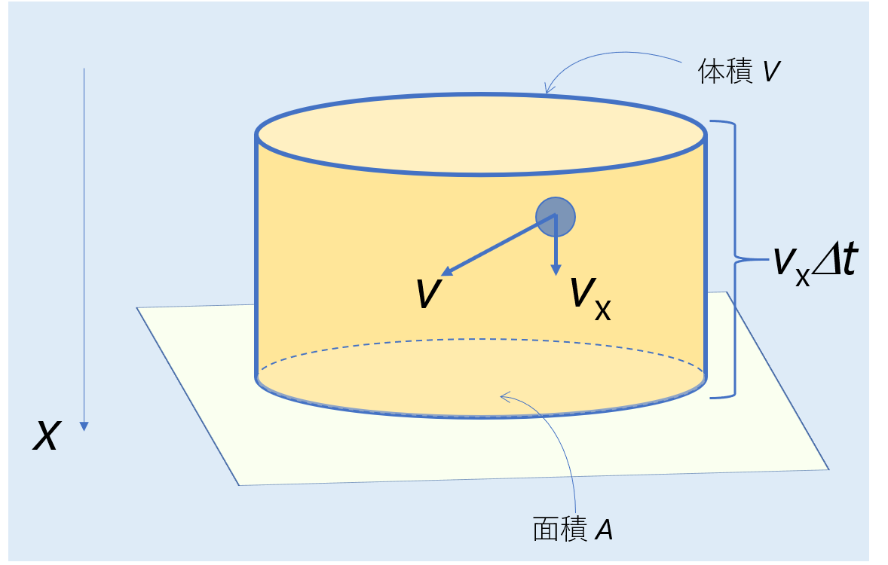
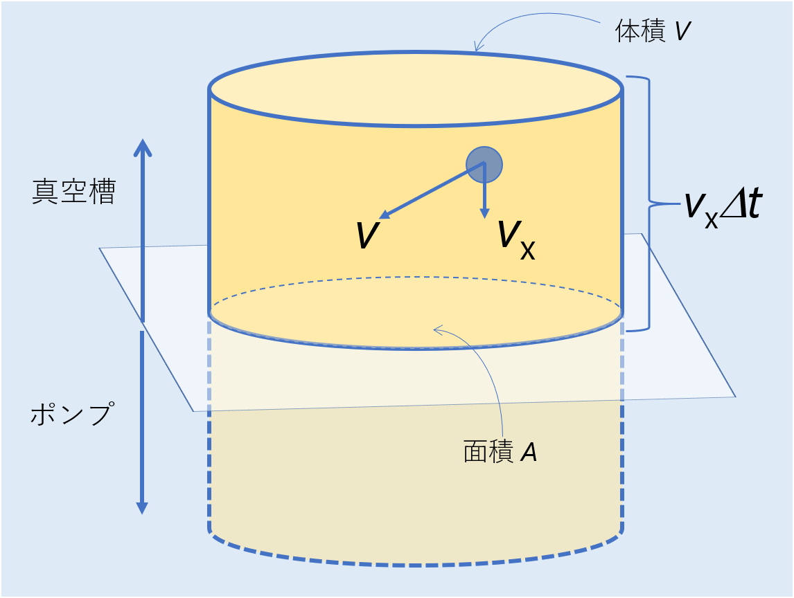

# 真空の作り方
## 気体分子の表面衝突
人工的な真空空間の作成過程が数式的にどのように記述されるのか導出するために、まずは固体表面への気体分子の吸着について考えてみます。 
ある平らな試料に対して、表面全体を覆う(飽和吸着)のには一体どれくらいの時間が必要なのでしょうか計算してみます。
ここでの飽和吸着は、実際の研究の場における薄膜成長や表面汚染として考えられます。
図に示すような、速度vxの分子が時間Δtの間に面積Aの平面に衝突する回数をCvとすると、これは体積V(=vxΔtA)の中に存在する速度vxの分子の数となるため
 
 
と書けます。ここでρは分子密度であり、ρVは体積Vに含まれる全ての速度の分子を表し、Maxwell分布を乗ずることで速度vxに対する数を得ています。

 
<em>図. 気体分子が表面に衝突する様子</em>

したがって、すべての速度の分子が平面Aに衝突する回数Cは
 
 
となります。更に、単位時間・面積あたりに衝突する回数C'に規格化すると
 
 
と表せます。ここで、[気体分子運動論](./gas.md)で求めた関係、を用いると
 
 [molecule/cm2s] 

が得られます。 
ここで、室温300 K,圧力P=10-4 Paにおける窒素分子N2(分子量M=28)の表面衝突の頻度C'を求めてみるとC'~3×1014 [molecule/cm2s]程度になります。一般に固体の表面原子数密度は1015 [atom/cm2]ですので、10-4 Paの下では表面は3秒程度で飽和吸着状態となることがわかります。 
したがって、10-4 Paの気体雰囲気中に1秒間程度表面を晒すことでおおよそ表面に単分子層だけ形成することができ、気体分子の導入量=圧力(真空度)×時間として
 
 
と表される導入量(被曝量)の単位、Langmuirが使われることもあります。

## 真空の作成
前置きが長くなりましたが、以上の議論を応用して真空の作成について眺めてみましょう。
先程考えた図中において、分子が衝突していた平面に穴が空いており、気体分子は上部(真空槽)から下部(ポンプ)へ移動している状態を考えましょう。これはまさしく気体の排気の描像ですね。 

 
<em>図. 気体分子が排気される様子</em>

先に導出したように、単位時間・面積あたりに分子が衝突(排気)する回数C'は
 
 
でした。
したがって、単位時間・面積あたりに廃棄される分子の体積C'vはρ=N/Vより、ρ-1=V/Nが1分子の占める体積となるので
 
 [l/cm2s] 
となります。 
またしても室温300 K, 空気の分子量M~29を用いて計算するとC'v,air~11.6 [l/cm2s]が得られます。この計算の仮定では、衝突した分子の跳ね返りは考慮しておらず全て表面に吸着しているしているものとしています。即ち完全に排気されている状態になっています。したがって、空気が完全に廃棄されるような理想的な排気速度はポンプ排気口の面積をA [cm2]とすると
 
 [l/s] 
と表されます。実際には完全に排気されないため、
 
 [l/s] 
のように表されます。ここでHoはホー係数と呼ばれ0~1の間の値を取りますが、典型的には0.2~0.5程度になります。
このようにして導出された速度で排気することで真空を作ることができます。

## バランス方程式
ここまで求めてきたように、排気速度Sで真空引きすることでとても良い真空が作れそうですが現実にはそう上手くはいきません。
それは真空槽の内部には空気以外に内壁等に吸着している不純物ガスが存在するためです。
いくら頑張って空気を排気しても、この真空槽からのガス放出により真空度は思うように良くなりません。
これを数学的に記述すると、不純物ガス容量をQとして微分方程式
 
  
が成り立ち、これをバランス方程式と呼びます。
体積Vは時間に依存しないため、P(t)のみに対する微分方程式として解くと
 
  
となります。ここで、十分に時間が経過すると(t→∞)
 
  
となり、結局真空槽の不純物ガス放出が最終的に到達する真空度を決定することがわかります。 
良い真空を作るため、つまりQを減らすためには 
・内部壁面からの残留ガスを減らす
・真空槽の漏れ(リーク)を減らす
・真空ポンプからのガスの逆流の減らす
などのケアを行う必要があります。

# Contents
[気体分子運動論](./gas.md) 
[真空の作り方]() 

# Return
[その他に戻る](../others.md) 
[Topに戻る](https://motoyashinozaki.github.io/minidora/)