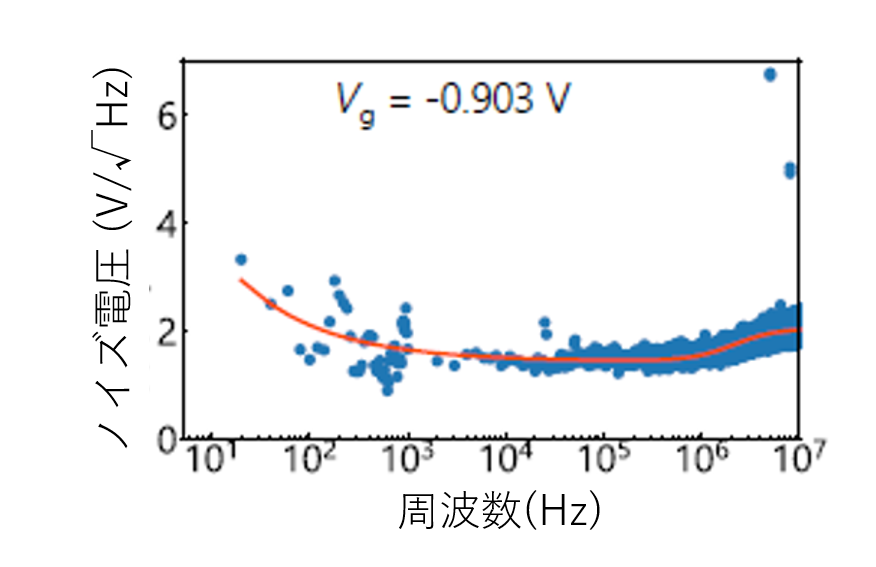

## 量子ドットの高周波反射測定における読み出しノイズ
## はじめに
半導体量子ドットの電荷状態を高速に読み出し手法として高周波反射測定がよく知られています([よくわかる解説.](https://motoyashinozaki.github.io/minidora/content/iroiro/rf_meas/rf_meas.html){:target="_blank"})。より高速(又は高精度)に電荷状態推定を行うためには読み出しノイズを低減する必要があります。本研究では通常の電流測定とは異なるこの測定系における読み出しノイズ特性を詳細に調べました。 

## 実験
高周波反射測定を用いて実時間測定を行い、フーリエ変換を施すことでノイズスペクトルの評価を行いました。(図1)
するとある10MHz程度以下で減衰する特徴的なノイズ特性が得られました。
この周波数特性は、高周波反射測定を構築するRLC共振器や低温アンプの特性を考慮することで、定量的に記述することができます。測定帯域がMHzオーダー以上ある場合、低温アンプの内因ノイズが読み出しノイズの主な要因となりえます。(経験的にアンプノイズの低減が大きな課題であることはよく知られていました。) 
更に、より1kHz以下の小さい周波数領域では急峻に増大する1/fノイズが現れます。
1/fノイズはアンプなどの内因ノイズとしてもよく知られていますが、高周波反射測定法は信号を振幅変調することでそのようなノイズを避けています。
にもかかわらず現れるこの1/fノイズは、量子ドット自体が有する1/fノイズの存在を示唆しています。
この1/fノイズ特性を詳細に調べると、センサ量子ドットにおいて電流が全く流れないようなクーロンブロケード領域は勿論、伝導度が最大となるような状況においても1/fノイズがほぼ現れないことを見出しました。
私達は、量子ドット特有の伝導特性と1/fノイズ振幅の結果を系統的に調べ、電荷ゆらぎが量子ドットにおける1/fノイズの起源の一つであり、実効的なゲートノイズ電圧として働いていることを詳細に示しました。(図2) 
1/fノイズは量子状態のデコヒーレンス要因となる一方で、それ自体からデバイス内部の不純物評価などを行うことができます。最近ではGaNなどパワー半導体における不純物ポテンシャル由来の量子ドット形成も報告されており、1/fノイズ自体を評価することも非常に重要です。 

 
<em>図1. 高周波反射測定法におけるノイズスペクトル</em>

 
<em>図2. 1/fノイズ振幅(上)と電気伝導度(下)のゲート電圧依存性</em>

## まとめ
高周波反射測定系の読み出しノイズの理解は応用・基礎研究の面からとても大切です。私達は系統的な実験により得られた読み出しノイズを、回路構成や量子ドットノイズを考慮して非常によく記述することができました。そして測定帯域によって読み出しノイズの主要因が大きく異なることを定量的に示しました。 
高周波反射測定法が高速測定を可能にするだけではなく、回路素子等の影響を避けて非常に感度良く1/fノイズの評価ができることは、今後の量子デバイス研究に非常に有用だと考えられます。(個人的な感想ですが、一般に物理的に意味のあるノイズを測定することは、高度な実験スキルが要求されるため非常に困難です)

## 参考文献
1. "Gate voltage dependence of noise distribution in radio-frequency reflectometry in gallium arsenide quantum dots" 
**Motoya Shinozaki**, Yui Muto, Takahito Kitada, Takashi Nakajima, Matthieu R. Delbecq, Jun Yoneda, Kenta Takeda, Akito Noiri, Takumi Ito, Arne Ludwig, Andreas D. Wieck, Seigo Tarucha, and Tomohiro Otsuka, 
[Applied Physics Express **14**, 035002 (2021).](https://iopscience.iop.org/article/10.35848/1882-0786/abe41f){:target="_blank"}  

2. "Formation of quantum dots in GaN/AlGaN FETs"
Tomohiro Otsuka, Takaya Abe, Takahito Kitada, Norikazu Ito, Taketoshi Tanaka, and Ken Nakahara, 
[Scientific Reports **10**, 15421 (2020).](https://www.nature.com/articles/s41598-020-72269-z){:target="_blank"}  

# Return
[Studyに戻る](../study.md) 
[Topに戻る](https://motoyashinozaki.github.io/minidora/)