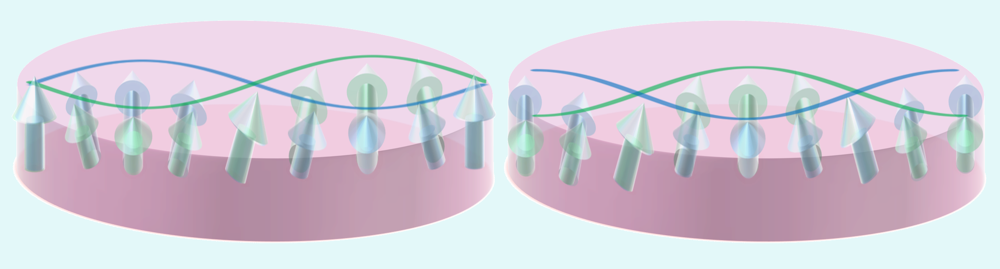
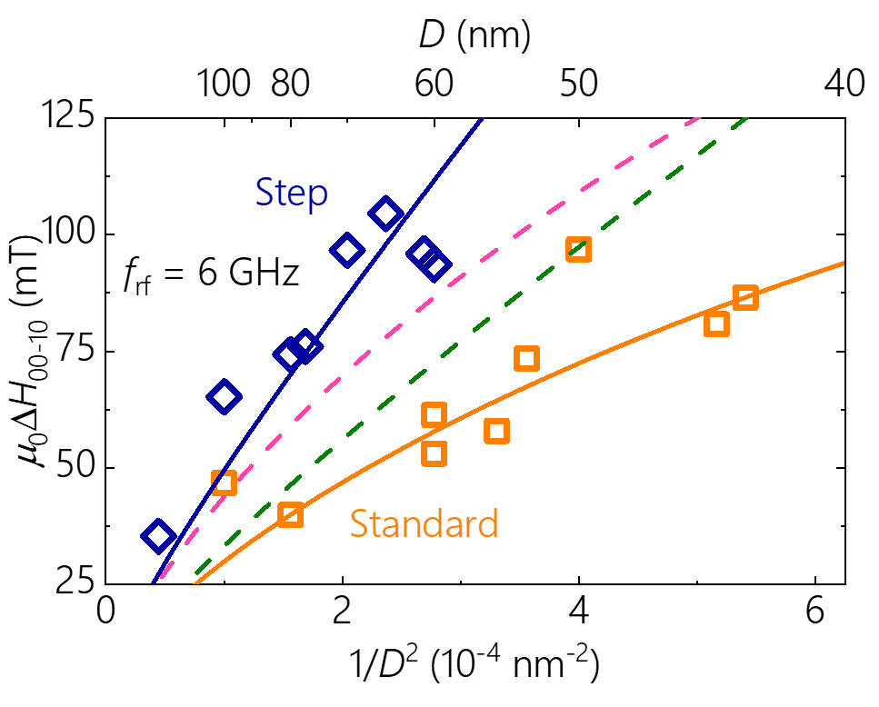

## 微細MTJ素子におけるスピン波の端状態
## はじめに
微細MTJ素子におけるスピン波は素子エッジ部の境界条件により量子化されます。これまでの研究で、微細加工プロセスがMTJ素子エッジ部の磁気異方性の劣化を齎すことが示唆されましたが、スピン波の境界条件にも何か影響を与えているのかを調べました。 

## 実験
MTJ素子におけるスピン波は、素子端部において固定端と自由端の2つの境界条件が考えられます(図1)。
磁気双極子相互作用のみを考慮する場合は理論的には固定端になることが知られているのですが、実際の微細素子ではどのようになるのかはわかりません。
境界条件は違いはスピン波励起に必要なエネルギーに影響を及ぼすのですが、その**影響は交換スティフネス定数を実効的に変調させる**ため、実際の実験で自由端または固定端どちらの状態になっているのかを同定するのは困難でした。
そこで、微細加工手法の異なるMTJ素子について測定を行いました。これ迄の研究からこれらの素子間には、素子エッジ部の磁気特性(磁気異方性)が異なることが示唆されています。使われている材料系は同じのため、この2つの構造について測定を行うことでエッジ部状態の違いがどのようにスピン波へ影響を及ぼすのかを詳細に調べました。 

 
<em>図1. 微細MTJ素子におけるスピン波, (左)固定端, (右)自由端</em>

周波数を固定して磁場掃引をすることでスピン波共鳴を測定しました。そして一番低次のスピン波モードと一様歳差モードとの共鳴磁場の差分$\mu_{0}\Delta H_{00-10}$を直径40~150nm程度のサイズの素子で調べました(図2)。
素子サイズが小さくなると$\mu_{0}\Delta H_{00-10}$が大きくなることがわかります。
直感的には、ロープ等の紐類を一捻りしようとする際、短いものほど捻るのが大変になるのと同じように、素子が小さいほど素子内のスピンを一捻りするのに必要なエネルギーが大きくなることを示しています。 
そしてこのエネルギー差$\mu_{0}\Delta H_{00-10}$は、2つの構造間で大きく異なることが明らかになりました。
素子エッジ部の磁気異方性の劣化の影響は、2つの共鳴モードの差分を取ることでほぼ相殺するため、無視することができます。$\mu_{0}\Delta H_{00-10}$に寄与する磁気特性として交換スティフネス定数がありますが、これは材料定数であるため基本的には2つの構造間でほぼ等しいはずです。 
そこで私達は境界条件として、素子エッジ部が劣化している構造では自由端、損傷が少ない構造では固定端をそれぞれ仮定して計算を行うことで、実験結果を上手に説明することができることを示しました。 
また、重要な点としてこれらエッジ部状態の違いによる影響が直径40nm以上のサイズの素子で顕著に見えていることが挙げられます。
従来研究されてきた単純な磁気特性の測定では、直径20nm程度まで微細化された素子において初めて2つの構造間での違いが顕在化してきました。
素子エッジ部での境界条件が課せられているスピン波は、比較的大きな素子サイズでもその影響を確認することができ、スピン波共鳴の測定が高感度なエッジ部状態のプローブになることを示唆しています。 

 
<em>図2. スピン波エネルギーの素子サイズ依存性</em>

## まとめ
磁性体のスピン波は非常に重要な研究トピックの1つです。そこで私たちは微細加工条件の異なる2つの素子間で詳細にスピン波を測定することにより、素子エッジ部における境界条件を明らかにしました。そして、スピン波共鳴から得られる素子エッジ部の情報は、40nm以上と磁気特性上は大きな変化が見られない比較的大きな素子サイズの結果にも反映されることがわかり、単純な磁気特性評価によるエッジ状態評価よりも、スピン波共鳴が高感度なツールであることが示唆されました。

## 参考文献
1. "Probing edge condition of nanoscale CoFeB/MgO magnetic tunnel junctions by spin-wave resonance" 
Motoya Shinozaki, Takaaki Dohi, Junta Igarashi, Justin Llandro, Shunsuke Fukami, Hideo Sato, and Hideo Ohno, 
[Applied Physics Letters **117**, 202404 (2020).](https://aip.scitation.org/doi/10.1063/5.0020591){:target="_blank"}  

2. "Free-layer Size Dependence of Anisotropy Field in Nanoscale CoFeB/MgO Magnetic Tunnel Junctions"
**Motoya Shinozaki**, Junta Igarashi, Hideo Sato, and Hideo Ohno, 
[ Applied Physics Express **11**, 043001 (2018).](https://iopscience.iop.org/article/10.7567/APEX.11.043001){:target="_blank"}  

# Return
[Studyに戻る](../study.md) 
[Topに戻る](https://motoyashinozaki.github.io/minidora/)