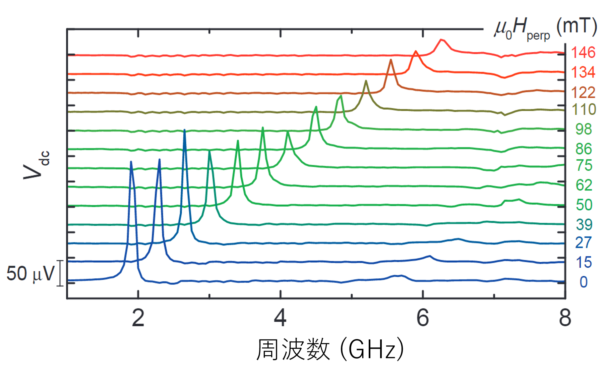
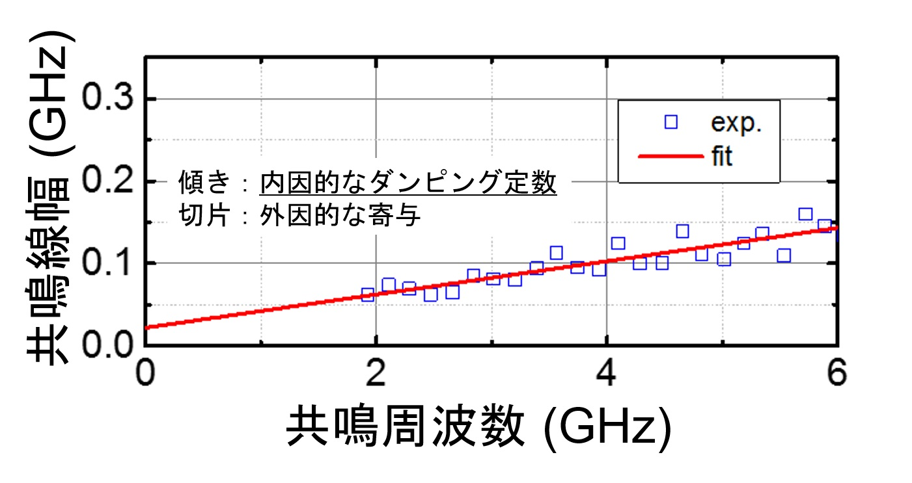

## 微細MTJ素子における磁気特性評価
 

## はじめに
次世代の不揮発性メモリとしてMRAM(Magnetoresistive RAM:磁気抵抗RAM)が注目されています。このMRAMのキー技術であるMTJ(Magnetic Tunnel Junction：磁気トンネル接合)素子は磁石の向きを電圧に変換することができ、MRAM以外にも様々な応用が期待されています。 
ここではMTJの動作特性を理解するために私たちが行った実験についてお話します。 

## 実験
MTJの原理については、"[いろいろ](./doradora)"を参照してください。 
MTJ素子をなるべく低消費電力で動作させるためには、低い電流値で情報の書き込みを行う必要があります。また、熱擾乱に対してどの程度の耐性があるのかを知る必要があります。前者を示すMTJ素子の動作特性を「**反転閾値電流**」、後者を「**熱安定性**」と呼び、MTJ素子を研究する上では欠かすことのできない大事な特性になります。 
この反転閾値電流や熱安定性を直接評価することはとても興味深いですが、そもそもこれらの動作特性は何によって決まるのでしょうか。
動作特性を決める要素の1つに、**MTJを構成する強磁性体の磁気特性**が挙げられます。したがってMTJ素子の動作特性を理解するためには、材料の磁気特性を詳細に調べる必要があります。  

そこで有用な手法として、2005年にTulapurkarさんらが発見した「スピントルクダイオード効果」が良く知られています。 
MTJ素子に外部磁界と数GHzという高周波信号を印可し、MTJ素子に発生する電圧の直流成分のみを測定することで、強磁性層の共鳴を検出することができます。 
この測定手法は2つの磁化方向の配置や印可する外部磁界方向がとても重要であり、私たちは磁気特性の評価に対して有用な磁化配置となるMTJ素子を作製しました。 
図1は外部垂直磁界の大きさを変えながら測定した共鳴スペクトルです。磁界の大きさを強くすると共鳴周波数も大きくなります。今回の測定系において、共鳴周波数と磁界強度は線形関係にあり、この磁界軸の切片から磁気異方性と呼ばれる磁気特性が得られます。 

 
<em>図1. 垂直磁界下における強磁性共鳴の検出</em>

また、共鳴スペクトルの半値幅と共鳴周波数の間にも図2のように線形関係が得られ、この傾きからはダンピング定数(磁気緩和定数)を評価することができます。 

 
<em>図2. 共鳴線幅と共鳴周波数の関係</em>

この2つの線形関係が得られた、というところが私たちの研究のミソです(2つの磁化配置や外部磁界方向により必ずしも線形関係が得られるとは限らないからです)。 
このようにして私たちは、MTJ素子を構成する強磁性体材料の磁気特性を評価することができました。 

## まとめ
MTJ素子の動作特性を理解するためには、材料の磁気特性を評価することが重要です。そこで外部垂直磁界下でも測定可能なMTJ素子を作製し、実際に磁気特性評価が可能であることを示しました。

## 参考文献
1. "Spin-torque diode effect in magnetic tunnel junctions" 
A. A. Tulapurkar, Y. Suzuki, A. Fukushima, H. Kubota, H. Maehara, K. Tsunekawa, D. D. Djayaprawira, N. Watanabe, and S. Yuasa, 
[Nature 438, 339 (2005).](https://www.nature.com/articles/nature04207){:target="_blank"}  

1. "Damping constant in a free layer in nanoscale CoFeB/MgO magnetic tunnel junctions investigated by homodyne-detected ferromagnetic resonance" 
**Motoya Shinozaki**, Eriko Hirayama, Shun Kanai, Hideo Sato, Fumihiro Matsukura, and Hideo Ohno, 
[Applied Physics Express 10, 013001 (2017).](https://iopscience.iop.org/article/10.7567/APEX.10.013001){:target="_blank"}  

# Return
## [Studyに戻る](../study.md)
## [Topに戻る](https://motoyashinozaki.github.io/minidora/)