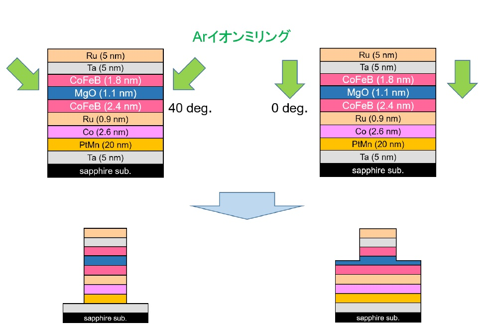
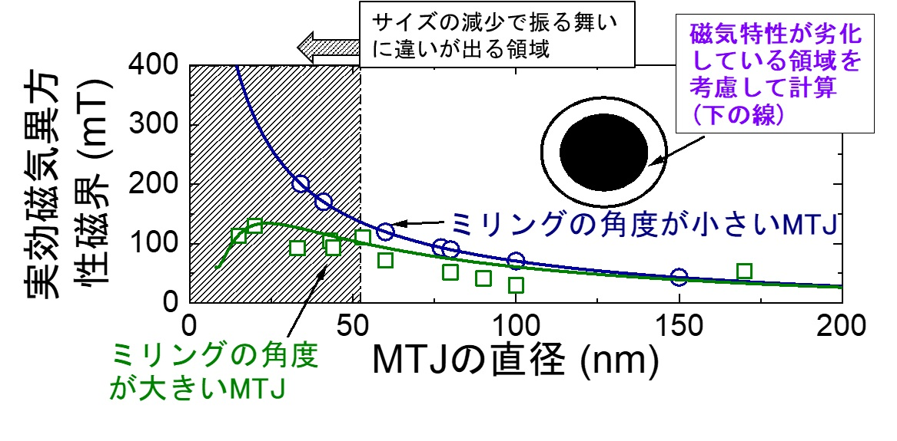

## 微細加工プロセスの磁気特性への影響
## はじめに
MRAM等への応用が期待されているMTJですが、その素子サイズは直径数十nm程度でとても微細なものです。そこで私たちは微細加工がMTJ素子の磁気特性に与える影響について調べました。 

## 実験
MTJ素子の磁気特性には素子形状の寄与が大きいです。そのため、そのまま微細加工されたMTJ素子を測定しても、形状効果による影響なのか、または微細加工自体による影響なのかを切り分けることができません。そこで私たちは、微細加工プロセスの条件を変えた2種類のMTJ素子を作製しました。この2つの素子で同じ測定を行い比較することで、微細加工プロセスの影響を議論することができます。 
素子を微細加工する手法の1つにイオンミリングがあります。その名の通り、イオンを思いきりぶつけて削っていく手法です。私たちは、このイオンミリングの角度を変えて素子を作製しました。1つは斜め40度からぶつけてミリングしたもの、これを通常構造とここでは呼びます。もう1つは真上0度からミリングしたもの、これをステップ構造と呼びます。(図1) 

 
<em>図1. プロセス条件の異なる2つの素子, (左)通常構造, (右)ステップ構造</em>

これら2種類の素子間では、**全く同じ材料構成・素子サイズにも関わらず磁化反転モードが異なる**ことが、私の友達の五十嵐君らの研究によりわかっていました。そこで私たちは、これら2種類の様々なサイズの素子における磁気異方性を評価しました。すると、サイズが40~50nm付近以下になると大きな差が現れてきました(図2)。 

 
<em>図2. 磁気異方性の素子サイズ依存性</em>

この実験結果を説明するために非常に簡単なモデルを仮定しました。ミリング角度が大きい通常構造は、素子エッジ部が損傷しており、磁気異方性が劣化しているだろうというモデルです。計算を簡単にするために、磁気異方性はMTJ素子内で均一に分布していると仮定します。 
このモデルを適用すると、素子が小さくなるほど損傷部分が全体に占める割合が大きくなるため、その影響が顕在化してきます。磁気工学的には、サイズが小さくなり素子形状が細い円柱状になるほど磁気異方性は増加するはずですが、通常構造では逆の振る舞いを見せています。 
一方でミリング角度が小さいステップ構造においては、今回測定したサイズ範囲内では磁性体本来の振る舞いを見せています。これらの結果から、微細加工プロセス(イオンミリング)により、素子エッジ部の磁気異方性が劣化することが示唆されました。 

## まとめ
MTJ素子の応用のためには、素子の微細加工が必要不可欠です。そこで私たちは微細加工条件の異なる2つの素子を作製し磁気特性の評価を行いました。その結果、磁気異方性と呼ばれる磁気特性がイオンミリングにより素子エッジ部で劣化している可能性を見出し、この影響は素子サイズが凡そ40nm以下程度で顕在化することを示しました。

## 参考文献
1. "Magnetic-field-angle dependence of coercivity in CoFeB/MgO magnetic tunnel junctions with perpendicular easy axis" 
Junta Igarashi, Justin Llandro, Hideo Sato, Fumihiro Matsukura, and Hideo Ohno, 
[Applied Physics Letters **111**, 132407 (2017).](https://aip.scitation.org/doi/10.1063/1.5004968){:target="_blank"}  

1. "Free-layer Size Dependence of Anisotropy Field in Nanoscale CoFeB/MgO Magnetic Tunnel Junctions"
**Motoya Shinozaki**, Junta Igarashi, Hideo Sato, and Hideo Ohno, 
[ Applied Physics Express **11**, 043001 (2018).](https://iopscience.iop.org/article/10.7567/APEX.11.043001){:target="_blank"}  

# Return
[Studyに戻る](../study.md) 
[Topに戻る](https://motoyashinozaki.github.io/minidora/)