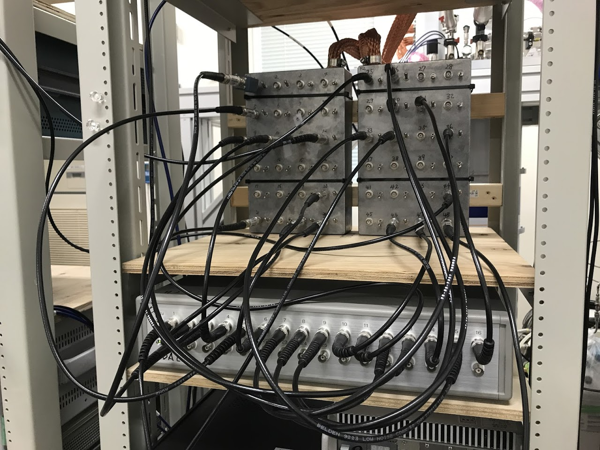

# Study
## 何やってるの
半導体技術の発展と共に長足の進歩を遂げてきた半導体集積回路は、情報通信機器はもとより医療や航空・宇宙、自動車などの多岐にわたる分野で使用されています。 
これまで集積回路は素子の微細化により性能向上が図られてきましたが、最近になり集積回路の性能向上を妨げる問題が顕在化してきてしまっています。 
その問題の一つは、静的消費電力の増大です。静的消費電力の増大要因は、DRAM(Dynamic Random Access Memory)やSRAM(Static RAM)に代表されるような半導体技術を用いたメモリが揮発性(情報を忘れてしまう)であることに起因しています。 
この静的消費電力の増大を解決すべく注目されているのが、スピントロニクス技術を用いた代表的なデバイスである**MTJ(Magnetic Tunnel Junction)**を用いた不揮発性メモリMRAM(Magnetoresistive RAM)です。 
MTJは、MRAM以外にも高感度磁場センサやナノスケール発振器、人工知能など様々な応用が期待されています。これらの応用に向けてMTJの設計指針等を確立すべく研究を行っています。 

また、ナノテクノロジーの台頭は集積回路の性能向上に加えて面白い舞台を提供し始めました。 
電子がナノメートルスケールの小さな箱の中に閉じ込められると、普段の我々の身の回りの物理現象とは異なる振る舞いをします。 
そこで、意図的に電子を閉じ込めることで発現する様々な量子力学的な現象の観測をしたり、それらの現象を応用することで従来の半導体デバイスとは全く異なる原理で動作する量子デバイスに関する研究を行っています。 

最近は機械学習やFPGAといったソフト・ハードウェアの面からスピントロニクスや量子デバイスの研究へのアプローチに興味があり、手を出そうとしています。  

# 主な成果
[微細MTJ素子における磁気特性評価](./apex2017/damping.md) 
[微細加工プロセスの磁気特性への影響](./apex2018/edgedamage.md) 
[微細MTJ素子におけるスピン波の端状態](./APL2020/spinwave.md) 
[半導体量子ドットの高周波反射測定法における読み出しノイズ評価](./apex2021/rfnoise.md) 
[ギャラリー(工事中)](./galley/sem.md) 

# Return
[Topに戻る](https://motoyashinozaki.github.io/minidora/)