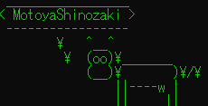

# Contents:
## [AboutMe](./content/introduction/introduction.md)
## [Study](./content/study/study.md)
## [Publications](./content/publication/publication.md)
## [Iroiro](./content/iroiro/iroiro.md)
## [Tweet](./content/news/tweet.md)
## [Others](./content/others/others.md)
 

更新履歴(Last update : 2022/4/29) :

<pre>
2022/4/29  : "Others (真空の物理)"を更新
2022/4/4  : "About me (自己紹介)"を更新
2022/3/15  : "Publications (国内学会・研究会等)"を更新
2021/10/26  : "Publications (国内学会・研究会等)"を更新
2021/10/26  : "Publications (国際会議)"を更新
2021/9/13  : "Publications (国内学会・研究会等),               Study (半導体量子ドットの高周波反射測定法における読み出しノイズ評価) "を更新
2021/7/24  : "Publications (その他出版物等)"を更新
2021/6/18  : "Publications (その他出版物等)"を更新
2021/3/4  : "Publications (国際会議)"を更新
2021/2/19  : "Publications (原著論文)"を更新
2020/12/27  : "Study (微細MTJ素子におけるスピン波の端状態)"を更新
2020/11/18  : "Publications (原著論文)"を更新
2020/9/23  : "Publications (国内学会・研究会等)"を更新
2020/8/26 : "Iroiro (MTJ, MTJ素子の熱安定性)"を更新
2020/8/26 : "Others (お馬さん)"を更新
2020/7/23 : "Iroiro (量子コンピューティングの基礎)"を更新
2020/7/5  : GitHub Pagesに移行
2020/6/28 : "その他 (競技プログラミング)"を更新
2020/6/6  : "その他 (量子力学と白色ノイズの観測)"を更新
2020/6/3  : "論文・発表 (国内学会・研究会等)"を更新
2020/5/27 : "自己紹介"を更新(GitHubリンク追加)
2020/5/17 : "近況", "その他(お馬さん)"を更新
2020/5/10 : "いろいろ(高速測定のための量子ドット設計指針)"を更新
2020/5/6  : "いろいろ(量子ドットの高速測定)"を更新
2020/5/3  : "近況", "その他(お馬さん)"を更新
2020/5/1  : "近況"を更新
2020/4/19 : "近況", "その他(お馬さん)"を更新
2020/4/12 : "近況"を更新
2020/4/10 : とりあえずアップ
</pre>

